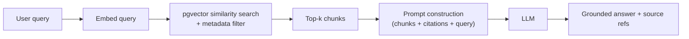

# CareerAI — AI Architecture

Status: Phase 0 design. Implemented starting Phase 5 (AI infrastructure), consumed by
Phases 6–12. Physically lives in the top-level `ai/` package plus the thin `apps/api/app/ai`
adapter — see [ARCHITECTURE.md §4](./ARCHITECTURE.md#4-backend-layering-appsapi).

## 1. Core principle: LLMs reason, code decides

Per spec §53/§28, the LLM is never the sole authority on a number that affects ranking, money,
or a pass/fail decision. Concretely:

| Task | Owner | Why |
|---|---|---|
| Resume overall score | Deterministic weighted formula ([ML_PIPELINE.md](./ML_PIPELINE.md)) | Reproducible, explainable, auditable |
| Skill extraction from resume text | NLP (spaCy/regex) + LLM extraction, reconciled | LLM alone hallucinates skills not in the text; regex alone misses phrasing |
| Job match score | Hybrid formula (embeddings + rules + ML), see §5 below | Needs to be explainable per spec §17/§18 ("explain WHY") |
| Skill-gap diffing | Set comparison against normalized taxonomy | Pure deterministic logic, no LLM needed |
| Interview answer correctness sub-score | LLM, rubric-constrained | Requires natural-language understanding; bounded by a structured rubric, not open-ended |
| Career path explanation text | LLM, grounded in the computed scores | LLM explains a decision it didn't make, so it can't invent a different one |

The LLM is used for: structured extraction, summarization, explanation generation, interview
question generation, evaluation of free-text answers against a rubric, and RAG-grounded Q&A.

## 2. Provider abstraction

```
ai/
  llm/
    base.py           # LLMProvider protocol: complete(), stream(), embed()
    openai_provider.py
    gemini_provider.py
    router.py          # picks provider/model per task from config, not hardcoded per call site
```

```python
class LLMProvider(Protocol):
    async def complete(self, prompt: PromptSpec, *, response_model: type[BaseModel] | None = None) -> LLMResult: ...
    async def stream(self, prompt: PromptSpec) -> AsyncIterator[str]: ...
    async def embed(self, texts: list[str]) -> list[list[float]]: ...
```

Services never import `openai` or `google.generativeai` directly — they depend on
`LLMProvider` — **with one flagged, deliberate exception**: `apps/api/app/ai/resume_extraction.py`
(Phase 4) calls `openai` directly, since Phase 4 needed real resume extraction working before
this abstraction existed and Phase 5 (this doc's own phase) is what formally owns building it.
That module's docstring says so explicitly; when Phase 5 lands, migrate it onto `LLMProvider`
and remove the exception rather than letting it become precedent for a second one.

Switching providers, or routing cheap tasks to a cheaper model and complex
reasoning to a stronger one, is a config change (`ai/llm/router.py` + environment variables),
not a code change across the app (spec §27, §39).

**Model routing example:** skill normalization / short classification → small/cheap model;
resume structured extraction, career explanation, interview evaluation → stronger model;
embeddings → dedicated embedding model, cached (§7).

## 3. Structured output validation

Every LLM call that returns structured data passes a Pydantic schema as `response_model`. The
provider adapter uses the vendor's native structured-output/JSON-mode feature where available,
and the result is **always** re-validated against the Pydantic model before it reaches a
service. On validation failure: one bounded retry with the validation error fed back into the
prompt, then a typed `AIExtractionError` — never a silently malformed object flowing downstream
(spec §13, §53).

## 4. Prompt management

```
ai/prompts/
  resume_extraction/v1.md
  resume_extraction/v2.md
  career_explanation/v1.md
  interview_question_gen/v1.md
  interview_evaluation/v1.md
  rag_answer/v1.md
```

Prompts are versioned files, not inline strings (spec §52). Each prompt file has: system
instructions, `{variables}`, and an expected output schema reference. A prompt registry loads by
`(name, version)`; `ai_conversations.request_meta` records which prompt version produced a given
result, so a prompt regression is traceable to a specific commit.

## 5. Embeddings & vector search

- Model: `text-embedding-3-small` (1536-dim) by default, provider-abstracted like completions.
- Generated for: resumes (full + per-section), jobs, skills, learning resources, interview
  questions, and RAG knowledge-base chunks — stored per [DATABASE.md §2](./DATABASE.md#2-entity-groups-erds).
- **Embedding cache:** content-hash → embedding, in Redis + a `embeddings` fallback row, so
  re-uploading an unchanged resume or re-indexing an unchanged job never re-embeds (§7).
- Semantic search combines cosine similarity (pgvector `<=>`) with metadata filters
  (location, seniority, remote) applied in the same SQL query — not a two-pass
  filter-then-re-rank unless the candidate set is large enough to need it.

## 6. RAG pipeline



- **Knowledge sources:** curated career guides, skill descriptions, job-description snippets,
  learning-resource summaries, interview-prep material (spec §20) — ingested via a chunking
  pipeline (`ai/pipelines/kb_ingest.py`) that splits on semantic boundaries (headings/paragraphs,
  ~300–500 tokens/chunk with overlap), not fixed-length slicing.
- **Grounding discipline:** the prompt instructs the model to answer *only* from provided
  chunks and to say so explicitly when the retrieved context doesn't cover the question, rather
  than falling back to parametric knowledge — this is the primary hallucination mitigation,
  measured in evaluation (§8).
- **Citations:** every RAG answer returns the source chunk IDs/titles it drew from; the frontend
  renders them so the user can verify (spec §20).

## 7. Cost control

- **Cache before call:** embedding cache (§5); response cache for deterministic-ish prompts
  (e.g. "explain skill X") keyed on `(prompt_version, input_hash)`.
- **Cheap model for cheap tasks:** classification/normalization tasks never hit the expensive
  model (§2).
- **Token budgets:** prompts truncate/summarize long inputs (e.g. full resume text) before
  sending, and `max_tokens` is capped per task type in config.
- **Deduplication:** `Idempotency-Key` on AI-triggering API routes (see [API.md §1](./API.md#1-conventions))
  stops accidental double-billing from client retries.
- **Never call an LLM for math:** reinforces §1 — every avoided LLM call is a cost saved as well
  as a correctness win.
- All of the above is measurable because every call logs to `ai_conversations`
  (tokens, latency, model, feature) — the admin AI-usage dashboard (Phase 13) is a query over
  this table, not a separate tracking system.

## 8. Agents

Implemented only where a single prompt-response can't do the job (spec §28):

| Agent | Role | Tools | Guardrails |
|---|---|---|---|
| Resume Analyst | Extract + score a resume | section parser, skill normalizer, scoring service | Structured output schema; never invents experience not in the source text |
| Career Advisor | Recommend career paths with explanations | recommendation service (read-only), RAG retriever | Explains scores it's given, doesn't compute its own |
| Job Matching Agent | Explain a computed match score in natural language | match score (read-only) | Same — explanation only, not scoring |
| Interview Agent | Generate questions, evaluate answers turn-by-turn | question bank, rubric, resume context | Rubric-bounded scoring dimensions, fixed question categories |
| Learning Planner | Sequence a roadmap from a skill gap list | skill taxonomy, prerequisite graph | Must respect prerequisite ordering computed deterministically |

Each agent is a **bounded workflow** (fixed steps, explicit input/output schemas), not an
open-ended autonomous loop — consistent with spec §28's "controlled workflows" requirement.
Every agent step logs to `ai_conversations` for evaluation and cost tracking.

## 9. Evaluation framework

```
ai/evaluation/
  resume_cases.json
  career_cases.json
  interview_cases.json
  rag_cases.json
  run_eval.py
```

Each case: input, expected properties (not necessarily exact-match — e.g. "must include skill
X", "must not claim a degree not present in source"), and a scoring rubric. `run_eval.py`
executes cases against a given `(prompt_version, model)` pair and reports:

- **Structured output validity rate** (schema-parse success)
- **Factuality/faithfulness** (for RAG: does the answer's claims trace to retrieved chunks?)
- **Consistency** (same input, repeated — variance across runs)
- **Completeness/relevance** (rubric-scored, sampled by human review initially, then
  LLM-as-judge validated against human ratings before trusting it at scale)

Results are stored with `model`, `prompt_version`, `input`, `output`, `score`, `timestamp` (spec
§29) so prompt or model changes can be compared against a baseline before shipping — this is the
regression gate referenced in [DEPLOYMENT.md](./DEPLOYMENT.md).

## 10. Safe logging

`ai_conversations.request_meta` stores prompt version, token counts, latency, and non-sensitive
parameters — not full resume text or raw PII by default. Full inputs/outputs are retained only
when a case is flagged for evaluation review, with the same retention/access controls as the
source data (see [SECURITY.md](./SECURITY.md)).
