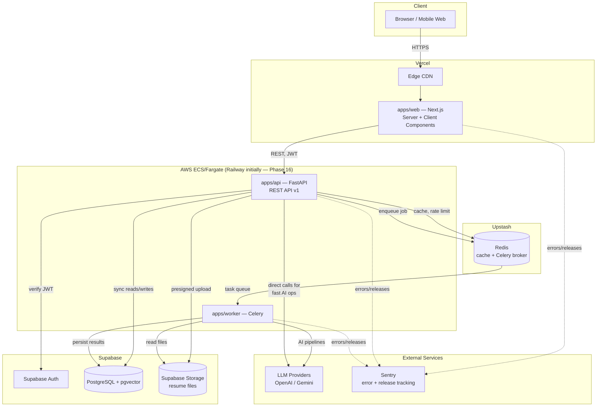
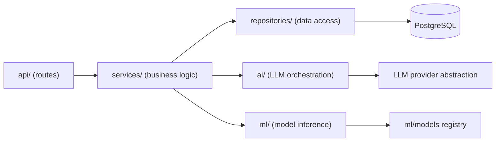
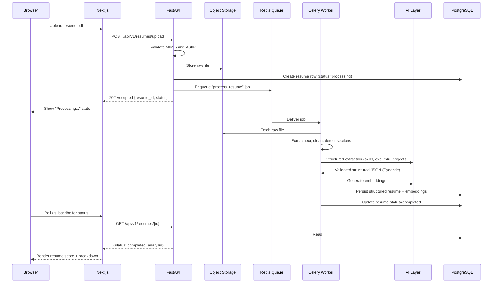
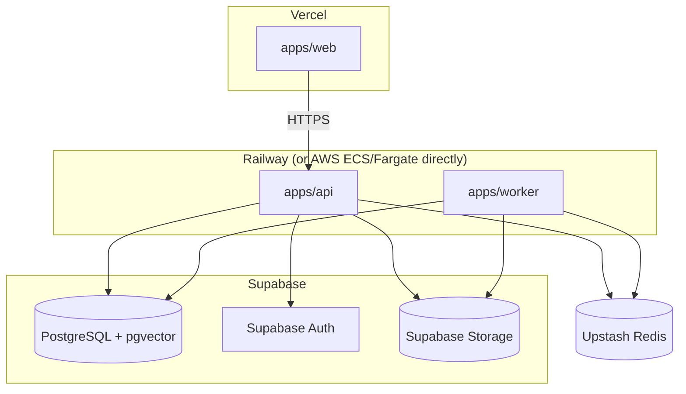
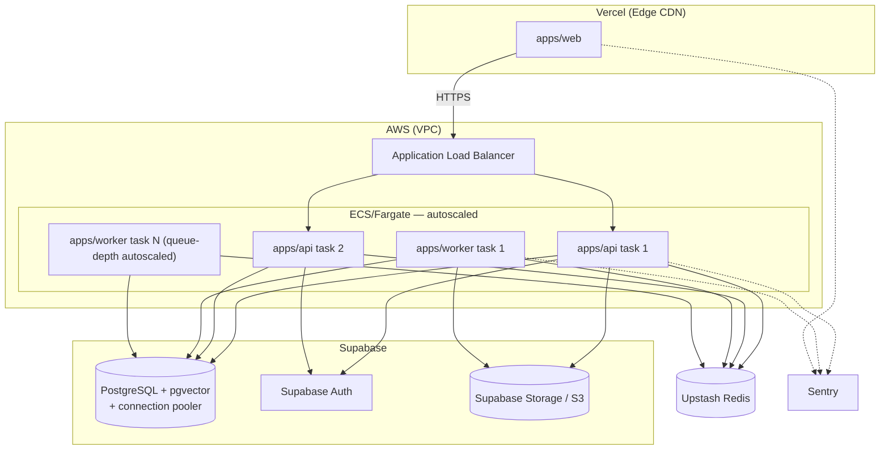

# CareerAI — System Architecture

Status: **Phase 0 — Architecture design.** No application code exists yet; this document is
the contract that Phases 1–17 implement against. See [ROADMAP.md](./ROADMAP.md) for the phase
breakdown and [../README.md](../README.md) for the repository layout.

## 1. Design goals

1. **AI-augmented, not AI-dependent.** Every score, rank, or decision that can be computed
   deterministically or with a small ML model *is*, and the LLM is reserved for reasoning,
   extraction, and generation — see [AI_ARCHITECTURE.md §1](./AI_ARCHITECTURE.md#1-core-principle-llms-reason-code-decides)
   and spec principle §53.
2. **Layered, testable backend.** No business logic in route handlers; API, service,
   repository, AI, and ML layers are separated so each can be unit-tested and swapped
   independently (e.g. change LLM provider without touching services).
3. **Async by default for anything expensive.** Resume parsing, embedding generation,
   interview evaluation, and roadmap generation never block an HTTP request — they run on
   Celery workers and report status back to the client.
4. **Observable and cost-aware from day one.** Every AI/ML call is logged with latency,
   token usage, and model identity so the admin dashboard (Phase 13) and cost controls
   (Phase 14) have data to work with — schema for this is in [DATABASE.md](./DATABASE.md)
   (`ai_conversations`, `audit_logs`).
5. **Boring, well-understood infra.** PostgreSQL + pgvector instead of a separate vector
   database; Redis for both cache and task queue; one relational source of truth. Fewer moving
   parts to operate for a project of this scope, and everything is explainable in an interview.

## 2. System context

**Why this shape:** the frontend never talks to the database, Redis, storage, or LLM
providers directly — everything routes through the FastAPI layer, which is the single place
authorization, validation, rate limiting, and audit logging are enforced (spec §31, §6). Vendor
choices are deliberately consolidated (Supabase bundles Postgres+pgvector, Auth, and Storage;
Upstash is serverless Redis with no cluster to manage) so there are fewer accounts, fewer
credentials, and fewer things to operate for a project at this scope — see §8 for the trade-offs.

## 3. Component responsibilities

| Component | Responsibility | Does NOT do | Runs on |
|---|---|---|---|
| `apps/web` (Next.js) | Rendering, client-side state, optimistic UI, calling the REST API, SEO surface (SSR/SSG) | Business logic, direct DB/LLM access, holding service-role secrets | Vercel |
| `apps/api` (FastAPI) | AuthN/Z enforcement, validation, orchestration, fast synchronous AI calls, enqueuing slow jobs | Long-running AI/ML work (>2–3s), sending email, heavy file parsing | Railway (Phase 16) → AWS ECS/Fargate (Phase 17) |
| `apps/worker` (Celery) | Resume parsing, embedding generation, interview evaluation, roadmap generation, analytics rollups, notifications, ML inference | Serving HTTP requests | Railway (Phase 16) → AWS ECS/Fargate (Phase 17) |
| PostgreSQL + pgvector | System of record for all relational data *and* vector similarity search | Being a message queue | Supabase |
| Redis | Task broker/result backend, response cache, rate-limit counters | Durable storage | Upstash |
| Object storage | Raw resume files (PDF/DOCX) | Structured data (that goes to Postgres after parsing) | Supabase Storage (or AWS S3 — see [DEPLOYMENT.md §5](./DEPLOYMENT.md#5-deployment-targets)) |
| Supabase Auth | Identity, session issuance, OAuth, password reset/verification | Application-level authorization (roles/permissions live in our DB, see [SECURITY.md](./SECURITY.md)) | Supabase |
| LLM providers | Reasoning, extraction, summarization, generation — behind our own provider abstraction | Deterministic scoring/ranking (see [AI_ARCHITECTURE.md](./AI_ARCHITECTURE.md)) | OpenAI / Gemini cloud APIs |
| Sentry | Error tracking, release health, performance tracing | Business logging (that's `ai_conversations`/`audit_logs` in Postgres) | Sentry cloud |

## 4. Backend layering (`apps/api`)

Rules that keep this from rotting into a ball of mud (spec §4, §52):

- **Routes** only: parse request → call one service method → map result to a response schema.
  No SQL, no prompt construction, no business rules.
- **Services** own business rules (resume scoring formula, job-match weighting, skill-gap
  diffing) and orchestrate repositories/AI/ML. Services depend on repository *interfaces*,
  not concrete SQLAlchemy sessions, so they're unit-testable with fakes.
  See [ML_PIPELINE.md](./ML_PIPELINE.md) and [AI_ARCHITECTURE.md](./AI_ARCHITECTURE.md) for how
  scoring/ranking/recommendation logic is actually implemented (hybrid rule+ML+embedding, never
  a bare LLM call).
- **Repositories** are the only layer that issues SQL/ORM queries.
- **`ai/` and `ml/`** inside the API app are thin adapters around the top-level `ai/` and `ml/`
  packages (which are framework-agnostic and independently testable/importable from notebooks
  and the worker).

## 5. Request flow: resume upload → analysis (representative end-to-end trace)

This same **upload → enqueue → 202 → background processing → poll/notify** pattern is reused
for interview evaluation and roadmap generation (spec §33).

## 6. Deployment topology

Two variants: the fast initial deploy (Phase 16) and the hardened target (Phase 17). Both share
the same application code and the same managed data layer — only where `apps/api`/`apps/worker`
run, and how much automation/scaling wraps them, changes.

### 6.1 Phase 16 — initial deployment

Goal: a real, working, HTTPS production URL with minimal infrastructure to hand-manage —
proves the pipeline end-to-end before investing in autoscaling.

### 6.2 Phase 17 — target production topology

Stateless API/worker tasks scale horizontally behind the load balancer (API on request
concurrency, workers on queue depth); state lives only in Postgres, Redis, and object storage.
Full rollout detail (WAF, secrets rotation, IaC, monitoring) is in
[DEPLOYMENT.md](./DEPLOYMENT.md) and [ROADMAP.md — Phase 17](./ROADMAP.md#phase-17--cloud--seo--production-deployment-).

## 7. Cross-cutting concerns and where they're documented

| Concern | Document |
|---|---|
| Auth, RBAC, secrets, OWASP mitigations | [SECURITY.md](./SECURITY.md) |
| Schema, indexes, ERD | [DATABASE.md](./DATABASE.md) |
| Endpoint contracts, versioning, error format | [API.md](./API.md) |
| LLM provider abstraction, RAG, agents, evaluation | [AI_ARCHITECTURE.md](./AI_ARCHITECTURE.md) |
| ML models, training, evaluation | [ML_PIPELINE.md](./ML_PIPELINE.md) |
| Design system, 3D strategy, responsive/accessibility | [UI_ARCHITECTURE.md](./UI_ARCHITECTURE.md) |
| CI/CD, Docker, environments | [DEPLOYMENT.md](./DEPLOYMENT.md) |
| Phase-by-phase plan and current status | [ROADMAP.md](./ROADMAP.md) |

## 8. Key architectural decisions (ADR-style summary)

| Decision | Alternative considered | Why this choice |
|---|---|---|
| PostgreSQL + pgvector for embeddings | Dedicated vector DB (Pinecone/Weaviate) | One database to operate and back up; joins between relational and vector data (e.g. "jobs similar to X AND in city Y") are trivial in SQL; sufficient performance at this project's scale |
| FastAPI over Django/Flask | Django REST Framework | Native async, Pydantic-first validation that doubles as the AI structured-output validation layer, best-in-class OpenAPI generation for the shared `packages/types` |
| Celery + Redis for background jobs | AWS SQS/Lambda, custom polling | Simple local dev (single `docker-compose up`), mature ecosystem, one broker for both caching and queueing |
| Supabase Auth over hand-rolled auth | Custom JWT auth, Auth0 | Managed email verification/password reset/OAuth reduces surface area; RBAC and audit logging still live in our own DB, so we're not locked into Supabase for authorization logic |
| Monorepo (apps/ + packages/) | Polyrepo (separate frontend/backend repos) | Shared types stay in sync, single PR can span a full-stack feature, one CI pipeline |
| LLM provider abstraction (not a direct SDK call) | Calling OpenAI SDK directly from services | Swappable providers, centralized cost tracking/logging, consistent structured-output validation — see [AI_ARCHITECTURE.md](./AI_ARCHITECTURE.md) |
| Supabase for Postgres+pgvector+Auth+Storage | Self-hosted Postgres, separate auth provider, separate S3 bucket | One vendor/dashboard for the whole data layer during early phases; each piece (DB, auth, storage) can still be swapped independently later since services depend on interfaces, not the vendor SDK directly |
| Upstash Redis (serverless) | Self-managed Redis, ElastiCache | No cluster to operate for a project this size; pay-per-request fits bursty AI-triggered background job load; trivial to swap for ElastiCache later if sustained throughput needs it |
| Railway for initial API/worker hosting, migrating to AWS ECS/Fargate in Phase 17 | Going straight to AWS ECS/Fargate | Railway gets a working production deploy in hours, not days, for Phase 16; ECS/Fargate is adopted once autoscaling, private networking, and IaC are actually needed (Phase 17) rather than paid for upfront |
| Sentry for error/release monitoring | Cloud-provider-native logging only | Structured error grouping, release tracking, and source-mapped stack traces across web/api/worker in one place, on top of (not instead of) the `ai_conversations`/`audit_logs` business-event logging in Postgres |

## 9. Non-functional requirements

- **Scalability:** stateless API/worker layers scale horizontally; expensive work is queued,
  not synchronous; heavy read paths (job search, market analytics) are cacheable in Redis.
- **Observability:** structured JSON logging with request IDs; AI calls logged to
  `ai_conversations` with latency/token counts (spec §38, §39); Sentry for error/release
  tracking across `apps/web`, `apps/api`, and `apps/worker` from Phase 17 onward.
- **Cost control:** embedding cache, response cache, cheap-model-first routing — detailed in
  [AI_ARCHITECTURE.md §7](./AI_ARCHITECTURE.md#7-cost-control).
- **Security:** see [SECURITY.md](./SECURITY.md) for the full threat-model-driven control list.
