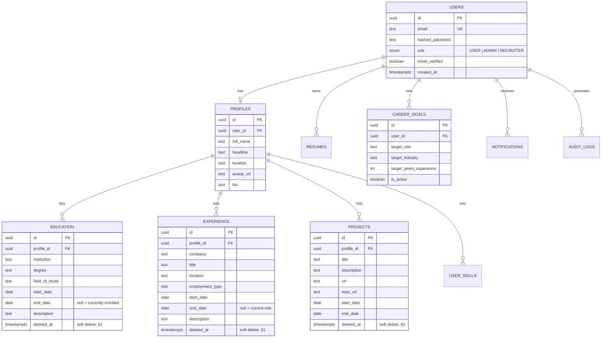
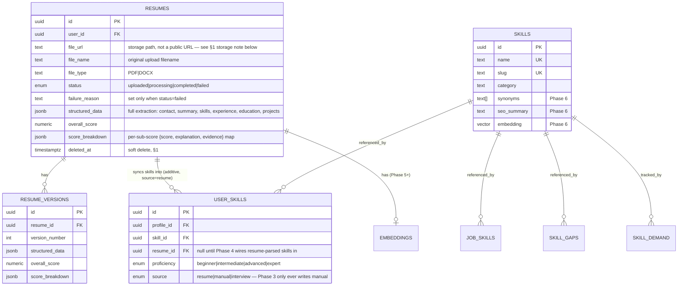
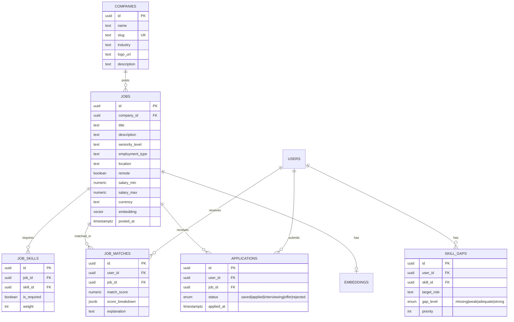
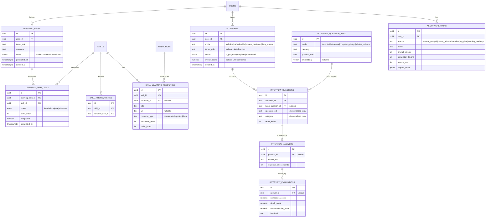
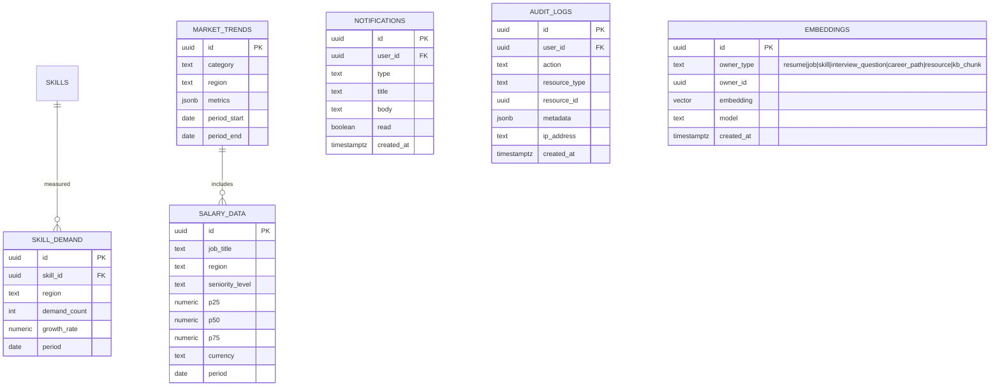
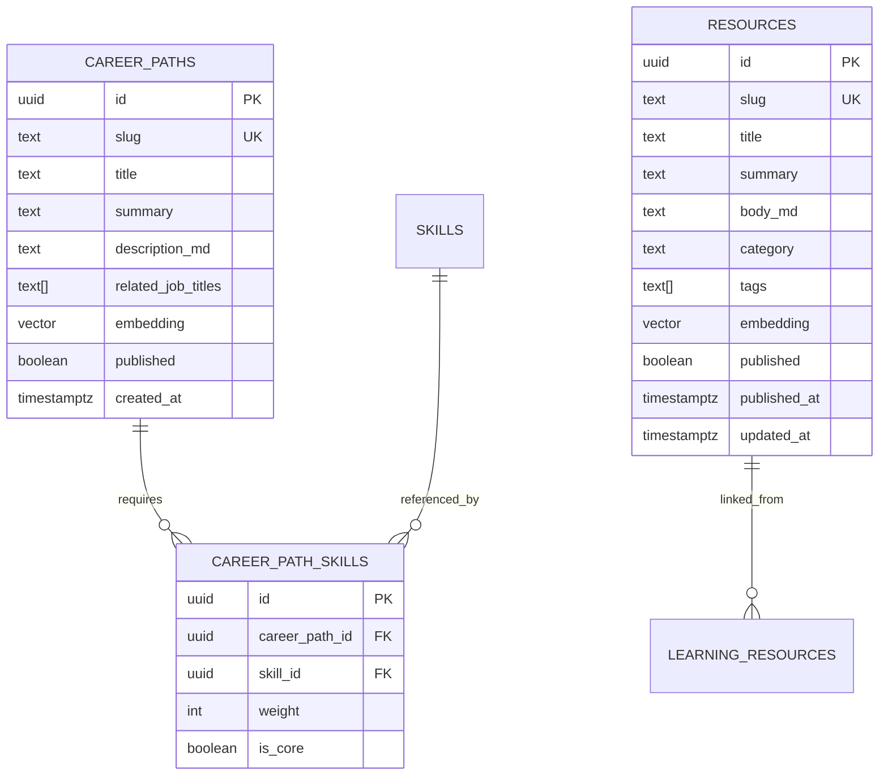

# CareerAI — Database Design

Status: Phase 0 design. Implemented via SQLAlchemy/SQLModel models + Alembic migrations
starting Phase 1 (core identity tables) and extended per-phase (see [ROADMAP.md](./ROADMAP.md)).

## 1. Conventions

- **Engine:** PostgreSQL 15+ with the `pgvector` extension enabled (`CREATE EXTENSION vector`).
- **Primary keys:** `UUID` (`gen_random_uuid()`), never auto-increment integers — avoids
  enumeration attacks on public-ish IDs (jobs, resumes) and simplifies future multi-region setup.
- **Timestamps:** every table has `created_at timestamptz NOT NULL DEFAULT now()` and
  `updated_at timestamptz NOT NULL DEFAULT now()` (maintained by an `updated_at` trigger).
- **Soft deletion:** user-facing content tables (`resumes`, `projects`, `applications`, etc.)
  carry `deleted_at timestamptz NULL`; hard deletes are reserved for GDPR-style erasure requests
  and cascade explicitly. Reference/lookup tables (`skills`, `companies`, `jobs`) are hard-deleted
  by admins only.
- **Naming:** snake_case tables and columns, plural table names, `<entity>_id` FK columns.
- **Money:** `numeric(12,2)` with an explicit `currency` column — never `float`.
- **Enums:** implemented as Postgres `ENUM` types for fixed small sets (roles, statuses) so
  invalid values are rejected at the DB layer, not just in Pydantic.
- **Embeddings:** `vector(1536)` columns (OpenAI `text-embedding-3-small` dimension; configurable
  per [AI_ARCHITECTURE.md](./AI_ARCHITECTURE.md)), indexed with `ivfflat` (cosine ops) once a
  table has enough rows to benefit (roughly >10k).

## 2. Entity groups (ERDs)

The full schema is 32 tables; splitting into logical groups keeps each diagram readable. Every
table is defined in detail in §3.

### 2.1 Identity & Profile



**Revised in Phase 4:** the full resume-extraction result (education/experience/projects, not
just skills) lives in `resumes.structured_data` (jsonb) instead of being merged into these
tables directly — merging would need real dedup/conflict-resolution UX (what happens when a
resume's "MIT 2018-2022" collides with a manually-entered "MIT 2018-2021"?) that hasn't been
designed. Only `SKILLS`/`USER_SKILLS` get auto-synced from a resume (additive, never
overwrites — see §2.2), since that's a simple "does this skill exist yet" check, not a
structural merge. Revisit if/when profile auto-fill from a parsed resume is actually wanted.

### 2.2 Resume & Skills



Phase 3 ships `SKILLS.name`/`slug`/`category` only — `synonyms`/`seo_summary`/`embedding`
are added by a later migration once Phase 6 (skill-gap engine, public `/skills/[slug]` pages)
actually needs them, rather than reserving unused columns now.

### 2.3 Jobs & Matching



### 2.4 Learning, Interviews & AI



**Deviation from this section's original design, decided during Phase 10 implementation:**
`LEARNING_RESOURCES` (the sketch above at the top of this file's history) has been split into
three tables, and `LEARNING_PATHS.phases` is no longer a `jsonb` blob:

- `LEARNING_PATH_ITEMS` replaces the old flat `LEARNING_RESOURCES` for what a roadmap actually
  sequences — one row per **skill**, not per resource. `completed`/`completed_at` live here (the
  skill level), not on a resource row: some skills have no curated resource at all, which would
  make them permanently unmarkable-complete under the original resource-level completion model.
  `phase`/`order_index` are computed by a deterministic topological sort over
  `SKILL_PREREQUISITES` (docs/AI_ARCHITECTURE.md §8's Learning Planner guardrail — the LLM never
  decides sequencing), fully recomputed on every regenerate; only `completed`/`completed_at`
  survive from the prior row.
- `SKILL_PREREQUISITES` and `SKILL_LEARNING_RESOURCES` are new, **shared curated reference
  tables** (like `CAREER_PATH_SKILLS`), not per-user data — a resource/prerequisite is authored
  once per skill and looked up by every user's roadmap, never duplicated per `LEARNING_PATH`.
  This also resolves a real inconsistency in the original sketch: it implied
  `LEARNING_RESOURCES` had an FK to `RESOURCES`, but its own entity definition never actually
  had one. `SKILL_LEARNING_RESOURCES.resource_id` is that FK now, nullable — set only when a
  step's content genuinely is one of the curated `/resources/[slug]` articles (Phase 9), with
  `url` covering the far more common external-official-docs case.
- `LEARNING_PATHS` gets `deleted_at` (soft-deleted like `APPLICATIONS`, with the same partial
  unique index over non-deleted `(user_id, target_role)` pairs) since it carries genuine
  user-authored progress, unlike `SKILL_GAPS`/`JOB_MATCHES`'s cached/recomputed category — see
  `app/models/learning_path.py`'s docstring for the full reasoning.

**Deviation from this section's original design, decided during Phase 11 implementation:**

- A new `INTERVIEW_QUESTION_BANK` table exists that the original sketch never had. `embedding`
  lives there, not on `INTERVIEW_QUESTIONS` as the original sketch put it — this is curated
  reference content the selection algorithm ranks against (like `RESOURCES.embedding`), authored
  once and shared across every user's sessions, not a per-session artifact that would need its
  own embedding call on every question asked. `INTERVIEW_QUESTIONS.question_text`/`category` are
  denormalized copies taken from the bank row at selection time (`bank_question_id` nullable FK,
  `ON DELETE SET NULL`, kept for traceability only) so a session's historical record stays stable
  even if the bank's curated content is later edited.
- `INTERVIEWS` gets `deleted_at` (soft-deleted, same reasoning as `LEARNING_PATHS` above — Phase
  11's scope explicitly includes "history," so this is durable user-authored content, not
  cached/computed output) but, unlike `LEARNING_PATHS`/`APPLICATIONS`, **no partial unique index**:
  a user legitimately runs many practice sessions for the same `mode`+`target_role`, so there's no
  natural key re-creation-after-delete needs to protect. `user_id` gets a plain btree index
  (§3 below); history-list pagination sorts on `(created_at, id)` at query time rather than
  needing its own composite index at this data volume.
- `INTERVIEWS.target_role` is nullable, plain free text — not required to resolve against
  `CAREER_PATHS` the way `SKILL_GAPS`/`LEARNING_PATHS.target_role` are. Those two features
  literally cannot compute without a curated `CareerPath` match; interview practice has real value
  even for a role with no curated catalog entry, so forcing a 404 here would block practice
  sessions for niche titles for no benefit. Resolution against `CAREER_PATHS` is attempted
  best-effort, only to feed question-selection ranking when it happens to succeed — resolution
  failure never blocks session creation. See `app/models/interview.py`'s `Interview` docstring for
  the full reasoning.
- `INTERVIEW_ANSWERS.question_id` and `INTERVIEW_EVALUATIONS.answer_id` are both `UNIQUE` — the
  1:1 relationship the original sketch's `o|` notation already implied, but which now also doubles
  as the concurrency guard's DB-level backstop (two racing submissions for the same question can't
  both insert; see `app/services/interviews.py::record_answer`'s pre-check + caught
  `IntegrityError` → 409).

### 2.5 Market Intelligence & System



`EMBEDDINGS` is a polymorphic table used for RAG knowledge-base chunks and any owner type that
doesn't warrant its own dedicated `vector` column; high-traffic lookups (skills, jobs) keep a
denormalized `vector` column directly on the entity table for join-free similarity search.

### 2.6 Public Content & SEO

Two tables back the SEO-indexable, publicly-crawlable content routes in
[SEO.md §1](./SEO.md#1-what-gets-indexed-vs-what-doesnt) (`/careers/[slug]`, `/skills/[slug]`,
`/companies/[id]`, `/resources/[slug]`). Both are deliberately **dual-purpose**: the same row
that renders a public SEO page also feeds the product's own AI features, so content is authored
once, not duplicated between "marketing content" and "app data."



- `CAREER_PATHS` is what `/careers/[slug]` (e.g. `/careers/ai-engineer`) renders, and is the
  same curated role/skill profile the Skill Gap Engine diffs a user's skills against
  ([ML_PIPELINE.md §2.3](./ML_PIPELINE.md#23-skill-gap-classification)) — `CAREER_PATH_SKILLS`
  is the structured join the gap engine reads; `description_md`/`summary` is what the public page
  renders.
- `RESOURCES` is what `/resources/[slug]` renders **and** the source content the RAG knowledge
  base ingests ([AI_ARCHITECTURE.md §6](./AI_ARCHITECTURE.md#6-rag-pipeline)) — `kb_ingest.py`
  chunks `body_md` for retrieval, while the same row is served directly (rendered from `body_md`)
  as a public article page. `resources.embedding` is a whole-document embedding used for "related
  articles" internal linking.
  **Deviation from this doc's original design, decided during Phase 9 implementation:**
  per-chunk RAG embeddings do **not** live in `EMBEDDINGS` (`owner_type = 'resource'`) as
  originally specified here. `EMBEDDINGS` has no text/content column — only a vector and an
  owner pointer — so it can't hold what retrieval needs to show a user (the chunk text itself),
  and its own docstring commits to an immutable, single-current-value-by-`created_at` lifecycle
  that's wrong for RAG chunks, which need a *set* of N rows per resource replaced atomically on
  re-ingestion. Reusing `EMBEDDINGS` would mean either violating that contract or leaving
  orphaned stale chunks from a prior ingestion mixed into future retrieval — a real correctness
  bug (citing removed content), not a style preference. Chunks live in a new dedicated
  `KB_CHUNKS` table instead:
  ```mermaid
  erDiagram
      RESOURCES ||--o{ KB_CHUNKS : chunked_into
      KB_CHUNKS {
          uuid id PK
          uuid resource_id FK
          int chunk_index
          text chunk_text
          vector embedding
          int token_count
          timestamptz created_at
      }
  ```
  `UniqueConstraint(resource_id, chunk_index)` backs a SAVEPOINT-based re-ingestion race fix
  (`app/services/skill_gap.py`'s exact pattern) in `kb_ingest.py`. See `app/models/kb_chunk.py`'s
  docstring for the full reasoning.
- `published`/`published_at` gates what's in the sitemap and public API responses — draft rows
  are queryable internally (e.g. by an admin editor, Phase 13) but never served publicly or
  indexed.
- `COMPANIES` (§2.3) already backs `/companies/[id]`; no new table needed there beyond the
  `slug`/`description` columns added above.

## 3. Indexing strategy

| Table | Index | Purpose |
|---|---|---|
| `users` | unique btree on `email` | login lookup |
| `resumes` | btree on `(user_id, created_at desc)` | "my resumes" list |
| `jobs` | ivfflat on `embedding` (cosine) | semantic job search |
| `jobs` | btree on `(remote, location)`, gin on `to_tsvector(title, description)` | filter + keyword fallback search |
| `job_matches` | unique btree on `(user_id, job_id)`, btree on `(user_id, match_score desc)` | dedupe + ranked match list |
| `user_skills` | unique btree on `(profile_id, skill_id)` | dedupe |
| `job_skills` | unique btree on `(job_id, skill_id)` | dedupe |
| `skills` | ivfflat on `embedding`, unique btree on `name`, unique btree on `slug` | synonym-robust skill resolution + `/skills/[slug]` lookup |
| `companies` | unique btree on `slug` | `/companies/[id]` (slug-in-URL) lookup |
| `career_paths` | unique btree on `slug`, partial btree on `slug WHERE published` | `/careers/[slug]` lookup + sitemap generation |
| `resources` | unique btree on `slug`, btree on `(published, published_at desc)` | `/resources/[slug]` lookup + sitemap/listing ordering |
| `ai_conversations` | btree on `(user_id, created_at desc)`, btree on `(feature, created_at)` | cost/usage dashboards |
| `audit_logs` | btree on `(user_id, created_at desc)` | admin audit trail |
| `embeddings` | ivfflat on `embedding`, btree on `(owner_type, owner_id)` | RAG retrieval |
| `interview_question_bank` | btree on `mode` | selection algorithm's per-mode candidate scan (no ivfflat on `embedding` — ranking runs in Python over the small per-mode candidate set `app/services/interviews.py::select_next_question` already fetched, not a SQL `<=>` query, at this table's curated ~30-row scale) |
| `interviews` | btree on `user_id` | ownership checks + history-list pagination |
| `interview_questions` | unique btree on `(interview_id, order_index)`, btree on `interview_id` | ordering + per-session lookups |
| `interview_answers` | unique btree on `question_id` | 1:1 enforcement + concurrency-guard backstop |
| `interview_evaluations` | unique btree on `answer_id` | 1:1 enforcement + concurrency-guard backstop |

## 4. Data integrity rules

- `resumes.status` transitions are enforced in the service layer as a state machine
  (`uploaded → processing → completed|failed`); the DB constrains the enum values only.
- `job_matches.match_score` and `skill_gaps.priority` are **written by the recommendation
  service**, never computed in SQL or by the LLM directly — see [ML_PIPELINE.md](./ML_PIPELINE.md)
  and [AI_ARCHITECTURE.md](./AI_ARCHITECTURE.md).
- Foreign keys from content tables to `users`/`profiles` use `ON DELETE CASCADE` for owned data
  (education, experience, projects) and `ON DELETE SET NULL` for cross-references that should
  survive (e.g. `audit_logs.user_id` after account deletion, for compliance retention).
- `career_goals` allows multiple rows per user but only one `is_active = true` at a time
  (partial unique index `WHERE is_active`).

## 5. Migrations

Alembic manages schema changes from Phase 1 onward. One migration per logical change (not one
giant "initial schema" migration per phase) so history stays reviewable. Migration naming:
`YYYYMMDDHHMM_<verb>_<subject>.py` (e.g. `202601151030_add_job_matches_table.py`).
