# CareerAI — Deployment & CI/CD

Status: Phase 0 design. Local Docker Compose ships in Phase 1; CI in Phase 1 (basic) and Phase
15 (hardened gates); production deployment is Phase 16. See [ROADMAP.md](./ROADMAP.md).

## 1. Environments

| Environment | Purpose | Data |
|---|---|---|
| `development` | Local machine, `docker-compose up` | Seeded/synthetic data |
| `staging` | Pre-production, mirrors prod config | Anonymized/synthetic data, safe to reset |
| `production` | Live | Real user data, backed up |

Each environment has its own `.env` (never committed — see [.env.example](../.env.example)),
its own database, and its own LLM API keys/budgets so a staging bug can't burn production AI
spend or touch real user data.

## 2. Local development (Docker Compose)

```
infrastructure/docker/
  Dockerfile.web
  Dockerfile.api
  Dockerfile.worker
  docker-compose.yml
```

`docker-compose.yml` brings up: `web` (Next.js dev server), `api` (FastAPI + `--reload`),
`worker` (Celery), `postgres` (with `pgvector` extension pre-installed via init script),
`redis`. Volumes mount source directories for hot reload; a `docker-compose.override.yml`
pattern allows local-only tweaks without touching the committed base file.

## 3. Docker images (production)

- **`web`:** multi-stage build — install deps, `next build` (standalone output), copy only the
  standalone server + static assets into a slim final image.
- **`api`:** multi-stage — install Python deps into a virtualenv layer, copy app code, run as a
  non-root user, `uvicorn`/`gunicorn` with multiple workers behind the platform's load balancer.
- **`worker`:** shares the API image's dependency layer (same `app/` package), different
  entrypoint (`celery -A app.workers worker`).

All images pin base image versions and run as non-root; secrets are injected via environment
variables at runtime, never baked into the image (spec §31, §48).

## 4. CI pipeline (GitHub Actions)

```mermaid
flowchart LR
    Push["Push / PR"] --> Install["Install deps\n(web + api, cached)"]
    Install --> Lint["Lint\nESLint + Ruff"]
    Lint --> Type["Type check\ntsc + mypy"]
    Type --> Unit["Unit tests\nVitest + Pytest"]
    Unit --> Integ["Integration tests\n(API against test DB)"]
    Integ --> AIEval["AI evaluation gate\n(ai/evaluation, only on ai/ or prompts/ changes)"]
    AIEval --> Build["Build\nnext build + docker build"]
    Build --> Sec["Security checks\ndependency audit, secret scan"]
    Sec --> E2E["E2E (Playwright)\non staging deploy only"]
    E2E --> Deploy["Deploy"]
```



- Separate workflows per app (`web`, `api`) triggered by path filters, plus a shared workflow
  for cross-cutting checks — avoids rebuilding the frontend for a backend-only change.
- The **AI evaluation gate** runs `ai/evaluation/run_eval.py` against the case sets whenever
  `ai/prompts/` or `ai/pipelines/` changes, comparing scores against the last known-good
  baseline (see [AI_ARCHITECTURE.md §9](./AI_ARCHITECTURE.md#9-evaluation-framework)) — a prompt
  change that regresses structured-output validity or faithfulness fails CI, not just a vibe
  check in review.
- `main` auto-deploys to `staging`; `production` deploys are a manual approval gate (tag-based
  release) — not automatic on every merge.

## 5. Deployment targets

- **`apps/web`:** Vercel (native Next.js support — ISR, edge middleware, image optimization,
  and the OG-image/sitemap routes from [SEO.md](./SEO.md) all work out of the box).
- **`apps/api` / `apps/worker`:** container platform with horizontal autoscaling
  (Render/Fly.io/Railway-class, or ECS/Cloud Run if AWS/GCP is preferred) — stateless, scales
  on CPU/queue depth.
- **PostgreSQL:** managed instance with `pgvector` enabled (Supabase Postgres, RDS, or Neon),
  automated backups, point-in-time recovery enabled for production.
- **Redis:** managed instance (Upstash/ElastiCache-class).
- **Object storage:** S3-compatible bucket for resume files, private by default, served via
  short-lived presigned URLs only.

Full topology diagram: [ARCHITECTURE.md §6](./ARCHITECTURE.md#6-deployment-topology-target--see-deploymentmd).

## 6. Domain, HTTPS, and SEO go-live checklist

Executed once during initial production launch (kept here rather than duplicated, but treated
as a deployment-gate checklist, not just an SEO nice-to-have):

1. Point the production domain's DNS at Vercel (web) and the API's platform (typically an
   `api.` subdomain); enforce HTTPS everywhere, HTTP→HTTPS redirect at the edge.
2. Confirm `NEXT_PUBLIC_SITE_URL` matches the canonical production host exactly (mismatches
   break canonical URLs, sitemap entries, and OG image URLs — see [SEO.md §7](./SEO.md#7-environment-variables)).
3. Deploy, then verify `/robots.txt` and `/sitemap.xml` resolve correctly against production.
4. Run through [SEO.md §6](./SEO.md#6-search-engine-setup-post-deployment-checklist): Search
   Console + Bing Webmaster verification, sitemap submission.
5. Run Lighthouse against the production landing page and confirm it meets the CI budget
   defined in [SEO.md §4](./SEO.md#4-core-web-vitals--performance-as-a-ranking-factor).

## 7. Configuration & secrets

- All environment variables documented in [.env.example](../.env.example); the pipeline fails
  fast at startup (Pydantic `Settings` validation) if a required variable is missing, rather
  than failing confusingly mid-request.
- Secrets live in the deployment platform's secret manager (Vercel/Render/GitHub Actions
  encrypted secrets), never in the repo, never logged (spec §31).

## 8. Rollback

Container platform deploys are versioned/immutable — rollback is redeploying the previous image
tag. Database migrations are written to be backward-compatible for one release where practical
(additive columns before removing old ones) so a rollback doesn't require a down-migration
under time pressure.

## 9. Monitoring in production

Structured logs shipped to the platform's log aggregation (or a lightweight external sink);
`ai_conversations`/`audit_logs` tables power the admin dashboards (spec §38, §40); uptime/error-
rate alerting configured once traffic is real (Phase 16), not deferred indefinitely.
