# CareerAI — Deployment & CI/CD

Status: Phase 0 design. Local Docker Compose ships in Phase 1; CI in Phase 1 (basic) and Phase
15 (hardened gates); first production deployment is Phase 16 (fast, minimal-infra); the target
cloud architecture — AWS ECS/Fargate migration, full SEO rollout, monitoring, scaling, and
production security hardening — is Phase 17. See [ROADMAP.md](./ROADMAP.md).

## 1. Environments

| Environment | Purpose | Data |
|---|---|---|
| `development` | Local machine, `docker-compose up` | Seeded/synthetic data |
| `staging` | Pre-production, mirrors prod config | Anonymized/synthetic data, safe to reset |
| `production` | Live | Real user data, backed up |

Each environment has its own `.env` (never committed — see [.env.example](../.env.example)),
its own database, and its own LLM API keys/budgets so a staging bug can't burn production AI
spend or touch real user data.

## 2. Local development (Docker Compose)

```
infrastructure/docker/
  Dockerfile.web
  Dockerfile.api
  Dockerfile.worker
  docker-compose.yml
```

`docker-compose.yml` brings up: `web` (Next.js dev server), `api` (FastAPI + `--reload`),
`worker` (Celery), `postgres` (with `pgvector` extension pre-installed via init script),
`redis`. Volumes mount source directories for hot reload; a `docker-compose.override.yml`
pattern allows local-only tweaks without touching the committed base file.

## 3. Docker images (production)

- **`web`:** multi-stage build — install deps, `next build` (standalone output), copy only the
  standalone server + static assets into a slim final image.
- **`api`:** multi-stage — install Python deps into a virtualenv layer, copy app code, run as a
  non-root user, `uvicorn`/`gunicorn` with multiple workers behind the platform's load balancer.
- **`worker`:** shares the API image's dependency layer (same `app/` package), different
  entrypoint (`celery -A app.workers worker`).

All images pin base image versions and run as non-root; secrets are injected via environment
variables at runtime, never baked into the image (spec §31, §48).

## 4. CI pipeline (GitHub Actions)

```mermaid
flowchart LR
    Push["Push / PR"] --> Install["Install deps\n(web + api, cached)"]
    Install --> Lint["Lint\nESLint + Ruff"]
    Lint --> Type["Type check\ntsc + mypy"]
    Type --> Unit["Unit tests\nVitest + Pytest"]
    Unit --> Integ["Integration tests\n(API against test DB)"]
    Integ --> AIEval["AI evaluation gate\n(ai/evaluation, only on ai/ or prompts/ changes)"]
    AIEval --> Build["Build\nnext build + docker build"]
    Build --> Sec["Security checks\ndependency audit, secret scan"]
    Sec --> E2E["E2E (Playwright)\non staging deploy only"]
    E2E --> Deploy["Deploy"]
```



- Separate workflows per app (`web`, `api`) triggered by path filters, plus a shared workflow
  for cross-cutting checks — avoids rebuilding the frontend for a backend-only change.
- The **AI evaluation gate** runs `ai/evaluation/run_eval.py` against the case sets whenever
  `ai/prompts/` or `ai/pipelines/` changes, comparing scores against the last known-good
  baseline (see [AI_ARCHITECTURE.md §9](./AI_ARCHITECTURE.md#9-evaluation-framework)) — a prompt
  change that regresses structured-output validity or faithfulness fails CI, not just a vibe
  check in review.
- `main` auto-deploys to `staging`; `production` deploys are a manual approval gate (tag-based
  release) — not automatic on every merge.

## 5. Deployment targets

### 5.1 Every environment (Phase 16 onward)

- **`apps/web`:** Vercel (native Next.js support — ISR, edge middleware, image optimization,
  and the OG-image/sitemap routes from [SEO.md](./SEO.md) all work out of the box).
- **PostgreSQL + pgvector:** Supabase — managed Postgres with `pgvector` pre-enabled, automated
  backups, point-in-time recovery on the production project, and Supabase Auth/Storage in the
  same project (fewer accounts to manage — see [ARCHITECTURE.md §8](./ARCHITECTURE.md#8-key-architectural-decisions-adr-style-summary)).
- **Redis:** Upstash — serverless, pay-per-request, no cluster to operate.
- **Object storage:** Supabase Storage by default (private buckets, short-lived signed URLs
  only); a plain AWS S3 bucket is a drop-in alternative if storage volume/cost later favors
  leaving Supabase for that piece specifically — the storage client is abstracted behind an
  interface for exactly this reason.
- **AI providers:** OpenAI/Gemini cloud APIs, behind the provider abstraction in
  [AI_ARCHITECTURE.md](./AI_ARCHITECTURE.md).

### 5.2 `apps/api` / `apps/worker` — Phase 16 vs. Phase 17

| | Phase 16 (initial) | Phase 17 (target) |
|---|---|---|
| Platform | Railway (or an equivalent Render/Fly.io-class PaaS) | AWS ECS/Fargate |
| Scaling | Manual instance count / platform autoscale defaults | ECS service autoscaling — API on request concurrency, workers on Celery queue depth |
| Networking | Platform-managed, public egress to Supabase/Upstash | Private VPC, security groups scoped to exactly what each service needs to reach |
| Provisioning | Console-configured | Infrastructure-as-code (Terraform or AWS CDK) — the ECS task definitions, service, ALB, and autoscaling policies are defined in `infrastructure/deployment/`, not clicked together |
| Why | Fastest path to a real, working production URL — proves the whole pipeline (web → api → worker → DB/Redis/storage → LLM) end-to-end without infra investment upfront | Adopted once autoscaling, private networking, and reproducible infra actually matter — not paid for speculatively in Phase 16 |

Both phases run the *same* Docker images from §3 — moving from Railway to ECS/Fargate is a
deployment-target change, not an application rewrite, because the app was containerized and
config-driven (§7) from the start.

Full topology diagrams: [ARCHITECTURE.md §6](./ARCHITECTURE.md#6-deployment-topology) (both
the Phase 16 and Phase 17 variants).

## 6. Domain, HTTPS, and SEO go-live checklist

Steps 1–3 execute at first production launch (Phase 16); steps 4–5 are revisited and made
durable — full structured data across every content type, Lighthouse budgets on every public
route, not just the landing page — in Phase 17. Kept here rather than duplicated, but treated
as a deployment-gate checklist, not just an SEO nice-to-have:

1. Point the production domain's DNS at Vercel (web) and the API's platform — an `api.`
   subdomain pointed at Railway initially, repointed at the ALB once Phase 17 migrates to ECS/
   Fargate; enforce HTTPS everywhere, HTTP→HTTPS redirect at the edge.
2. Confirm `NEXT_PUBLIC_SITE_URL` matches the canonical production host exactly (mismatches
   break canonical URLs, sitemap entries, and OG image URLs — see [SEO.md §7](./SEO.md#7-environment-variables)).
3. Deploy, then verify `/robots.txt` and `/sitemap.xml` resolve correctly against production.
4. Run through [SEO.md §6](./SEO.md#6-search-engine-setup-post-deployment-checklist): Search
   Console + Bing Webmaster verification, sitemap submission.
5. Run Lighthouse against the production landing page and confirm it meets the CI budget
   defined in [SEO.md §4](./SEO.md#4-core-web-vitals--performance-as-a-ranking-factor).

## 7. Configuration & secrets

- All environment variables documented in [.env.example](../.env.example); the pipeline fails
  fast at startup (Pydantic `Settings` validation) if a required variable is missing, rather
  than failing confusingly mid-request.
- Secrets live in the deployment platform's secret manager — Vercel/Railway/GitHub Actions
  encrypted secrets in Phase 16, AWS Secrets Manager (injected into ECS task definitions) once
  Phase 17 migrates the backend — never in the repo, never logged (spec §31).
- **Rotation (Phase 17):** LLM API keys, the Supabase service-role key, and `SECRET_KEY` are on
  a defined rotation schedule with no-downtime rollover (old + new key both valid during the
  rotation window), not rotated only reactively after a suspected leak.

## 8. Rollback

Container platform deploys are versioned/immutable — rollback is redeploying the previous image
tag. Database migrations are written to be backward-compatible for one release where practical
(additive columns before removing old ones) so a rollback doesn't require a down-migration
under time pressure.

## 9. Monitoring in production

- Structured logs shipped to the platform's log aggregation in Phase 16 (Railway logs), moving
  to CloudWatch once Phase 17's ECS/Fargate migration lands; every log line carries a request ID
  for cross-service correlation.
- **Sentry** (Phase 17) instrumented in `apps/web`, `apps/api`, and `apps/worker` — error
  tracking, release health (tagged by deploy/commit SHA), and performance tracing for slow
  endpoints. This sits alongside, not instead of, the `ai_conversations`/`audit_logs` tables that
  power the admin dashboards (spec §38, §40): Sentry answers "what broke," the Postgres tables
  answer "what did this user/feature/model cost and do."
- Uptime and error-rate alerting configured once traffic is real (Phase 16 baseline via the
  platform's built-in checks), formalized into on-call-relevant alert thresholds in Phase 17.

## 10. Cloud infrastructure hardening (Phase 17)

- **Compute:** `apps/api` and `apps/worker` move from Railway to AWS ECS/Fargate — task
  definitions per service, an Application Load Balancer in front of the API tasks, and
  autoscaling policies (API: request count per target; worker: Celery/Redis queue depth via a
  custom CloudWatch metric).
- **Networking:** both services run inside a private VPC; only the ALB is internet-facing.
  Security groups scope egress to exactly Supabase, Upstash, and the configured LLM provider
  endpoints — not open egress by default.
- **Infrastructure-as-code:** the ECS cluster, task definitions, ALB, autoscaling policies, and
  IAM roles are defined in `infrastructure/deployment/` (Terraform or AWS CDK — one tool, not a
  mix) and applied through CI, so the production topology is reproducible and reviewable as a
  diff rather than living only in the AWS console.
- **Database scaling:** connection pooling via Supabase's built-in pooler (PgBouncer) sized for
  the expected concurrent connection count from autoscaled API/worker tasks, which is
  meaningfully higher than the single-instance Phase 16 setup.

## 11. Production security hardening (Phase 17)

Extends the code-level controls in [SECURITY.md](./SECURITY.md) with infrastructure-level ones
that only make sense once there's a real production environment to harden:

- **Edge protection:** WAF rules (or Vercel's/AWS's native equivalent) in front of the public
  surface, rate limiting at the edge as a first line ahead of the application-level limiter in
  [API.md §4](./API.md#4-rate-limiting).
- **Supply chain:** container image scanning (e.g. Trivy) in CI for the `api`/`worker` images,
  alongside the existing dependency audit step in §4.
- **Secrets rotation:** per §7.
- **Re-verification:** the OWASP pass from [ROADMAP.md — Phase 15](./ROADMAP.md#phase-15--production-hardening-)
  is re-run against the live production environment specifically (headers, TLS config, exposed
  ports/services), not assumed to still hold just because it passed at the code level.
