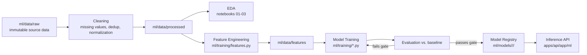

# CareerAI — ML & Data Science Pipeline

Status: Phase 0 design. Implemented starting Phase 8 (data science foundation), with the
earlier deterministic scoring formulas in this document used from Phase 4 onward (they don't
require a trained model, just the data itself). See [ROADMAP.md](./ROADMAP.md).

## 1. Principle: baseline first, model only if it earns its place

Per spec §54: every model needs a problem definition, dataset, features, a **baseline**, and
honest evaluation against that baseline. A model is not shipped because accuracy looks high in
isolation — it's shipped because it beats a simple rule-based or statistical baseline on a held-
out set, and the failure modes are understood.

## 2. Deterministic scoring layer (no model required)

These run from day one on rule-based formulas — every weight below is a named constant in
`app/core/config.py` (or a `scoring_weights` admin-editable table later), never inlined in
service code, so it's tunable without a redeploy.

### 2.1 Resume score

```
resume_score =
    0.15 * ats_compatibility +
    0.20 * skills +
    0.15 * experience +
    0.15 * projects +
    0.10 * education +
    0.10 * achievements +
    0.10 * keywords +
    0.05 * structure
```

Each sub-score (0–100) has its own explainable rule set, e.g.:
- `ats_compatibility`: parseable sections detected, no tables/images blocking text extraction,
  standard section headers found.
- `skills`: taxonomy coverage relative to the target role's required skill set.
- `quantification` (feeds into `achievements`/`experience`): fraction of experience bullets
  containing a number/metric.

Every sub-score returns a `{score, explanation, evidence}` object so the frontend can show
*why* (spec §14) — this is served by the API, not computed client-side.

### 2.2 Job match score

```
job_match_score =
    0.35 * semantic_similarity +   # cosine(resume_embedding, job_embedding)
    0.25 * skill_overlap +          # |required ∩ candidate| / |required|, weighted by job_skills.weight
    0.15 * experience_match +       # years/seniority alignment
    0.10 * education_match +
    0.10 * preference_match +       # career_goals alignment
    0.05 * location_match
```

Configurable via the same weights mechanism as §2.1 (spec §18). The Job Matching Agent
([AI_ARCHITECTURE.md §8](./AI_ARCHITECTURE.md#8-agents)) explains this score in natural
language — it does not recompute it.

### 2.3 Skill-gap classification

Deterministic set comparison: candidate skills (from `user_skills`) vs. the target role's skill
profile (curated per-role skill weightings, informed by aggregated `job_skills` data). Output
buckets (docs/DATABASE.md §2.3 `skill_gaps.gap_level`): missing / weak / adequate / strong,
each with a priority.

**Phase 6 implementation note:** priority is `career_path_skills.weight` (doubled if
`is_core`), doubled again for `missing` vs. `weak` — `skill_demand` (docs/DATABASE.md §2.5)
doesn't exist yet (it needs aggregated real job postings, which is Phase 7/8's job), so it
isn't a factor yet. Once it lands, blend it into the same formula (`app/services/
skill_gap.py::_priority`) rather than replacing it — weight/core-ness is still a real signal
even where demand data is thin.

## 3. Trained ML models

| # | Model | Type | Target | Baseline compared against |
|---|---|---|---|---|
| 1 | Job suitability classifier | Binary/multiclass classification (XGBoost) | P(candidate suitable for job category) | Rule-based skill-overlap threshold |
| 2 | Career recommendation model | Learning-to-rank / multiclass | Rank career paths for a candidate | Cosine similarity on embeddings alone |
| 3 | Skill clustering | Unsupervised (KMeans/HDBSCAN over skill embeddings) | Discover skill "families" beyond hand-curated taxonomy | Manually curated category labels |
| 4 | Salary prediction | Regression (XGBoost/GBM) | Predict salary range from role/skills/experience/location | Median salary by (title, region) lookup |
| 5 | Job category classifier | Multiclass classification | Normalize free-text job titles into a taxonomy | Keyword/regex title matcher |
| 6 | Skill-demand forecasting | Time-series (Prophet or simple linear trend) | Forecast skill demand growth | Naive last-period-value forecast |

Each model card (created when the model ships, stored alongside the artifact in `ml/models/`)
records: features used, training data window, baseline, evaluation metric + score, known
limitations, and the date it was last retrained.

### Evaluation metrics by task type

- Classification (models 1, 5): accuracy, precision, recall, F1, ROC-AUC; confusion matrix
  reviewed for class imbalance issues, not just aggregate accuracy.
- Ranking (model 2): NDCG@k against held-out user-labeled "good fit" career paths.
- Clustering (model 3): silhouette score + qualitative review (do clusters make domain sense?).
- Regression (model 4): MAE, RMSE, and residual plots by seniority band (a model that's
  accurate on average but bad for junior roles specifically is not acceptable).
- Forecasting (model 6): MAE against a rolling backtest window.

## 4. Data science pipeline



**Production logic lives in `ml/training/*.py` modules, imported by notebooks — not written
inline in notebooks** (spec §24), so training is reproducible outside Jupyter (CI, scheduled
retraining) and unit-testable.

### Notebooks (exploration only, per spec §24)
```
ml/notebooks/
  01_data_collection.ipynb
  02_data_cleaning.ipynb
  03_eda.ipynb
  04_feature_engineering.ipynb
  05_skill_analysis.ipynb
  06_job_analysis.ipynb
  07_model_training.ipynb
  08_model_evaluation.ipynb
```

## 5. Data quality handling

- **Class imbalance** (e.g. far more "not suitable" than "suitable" job-candidate pairs):
  class weighting or resampling, evaluated with F1/ROC-AUC rather than raw accuracy.
- **Missing values:** explicit imputation strategy per feature (documented in the feature
  engineering module), never silent `NaN → 0`.
- **Leakage:** train/validation/test splits are time-based where relevant (e.g. don't train on
  job postings from after the test window) and features are audited to ensure nothing derived
  from the label sneaks in (e.g. salary bucket used to predict salary).
- **Overfitting:** k-fold cross-validation during model selection; final held-out test set
  touched only once per model version.

## 6. Model registry & versioning (MLOps, Phase 14)

- Artifacts serialized (`joblib`/ONNX where beneficial for inference speed) under
  `ml/models/<model_name>/<version>/` with a `metadata.json` (metrics, training date, git
  commit, feature schema hash).
- `apps/api/app/ml` loads the version pinned in config (`MODEL_VERSION_JOB_SUITABILITY=1.2.0`,
  etc.) — rollback is a config change, not a redeploy of training code.
- Inference is synchronous for fast models (skill clustering lookup, category classification)
  and routed through the worker for anything involving a full resume re-scoring pass.
- Monitoring tracks prediction distribution drift and input feature drift over time; a
  significant drift triggers a retraining task (semi-automated initially, scheduled job later).

## 7. Explainability

Every ML prediction surfaced to a user includes the top contributing features (e.g. SHAP values
for tree-based models, or simple coefficient inspection for linear baselines) — consistent with
the platform-wide rule that every score gets an explanation (spec §14, §17, §18).
